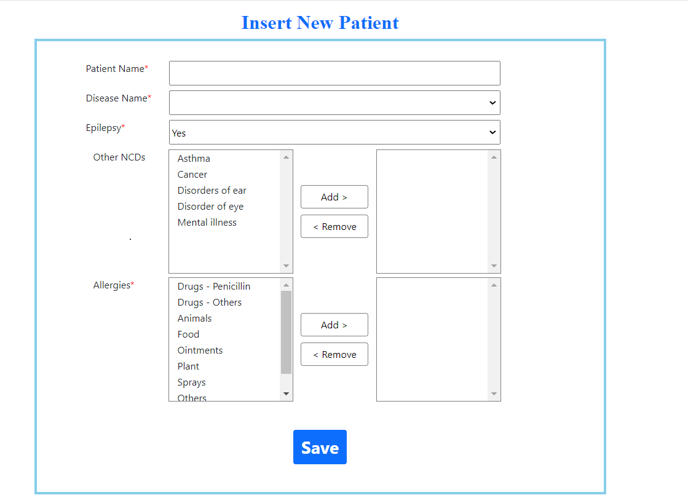

# Patient_Information_Project

## Overview

This repository contains the completed Patient Information Portal project, developed using Web API in .NET Core MVC. The project aims to store, manage, and display patient information through a user-friendly interface.

## Key Highlights of the Project:

- **UI Design: The UI design, as outlined in "UI Design.pdf," has been faithfully replicated.
- **Front-end: Developed using MVC Core (>=6.0).
- **Back-end: Implemented using Web API (>=6.0) with Entity Framework Core for data operations.
- **Database: Utilized MS SQL Server, and the SQL script is included in the project folder.
- **Repository Pattern: The repository code pattern has been applied for efficient data access.

## Getting Started

To access and run the Patient Information Portal project locally, follow these steps:

1. **Clone the Repository:**
   

2. **Navigate to the Project Directory:**
 

3. **Database Setup:**
   - This is a Code First approach. Database will created automatically. No Need to Run 'update-database' command.

4. **Run the Application:**
   - Open the project in Visual Studio or your preferred IDE.
   - Build and run the solution.

5. **Access the Application:**
   - Open your web browser and navigate to the specified localhost address.

## Features

- **Insert, Update, Delete, and Display Patient Information:** The application allows seamless management of patient records.
- **UI Design:** The UI design is in compliance with the provided "UI Design.pdf."
- **Unit Testing:** Thorough unit testing has been performed to ensure application reliability.
- **Repository Pattern:** The repository code pattern is applied for efficient data access.

## Important Note

This project does not require the 'update database' command, as the necessary SQL script is provided for database setup.

## Feedback

Your feedback is valuable. If you encounter any issues or have suggestions for improvement, please feel free to open an issue or reach out to me.

Thank you for exploring the Patient Information Portal project!

Best Regards,
MD. MANJURUL ISLAM
